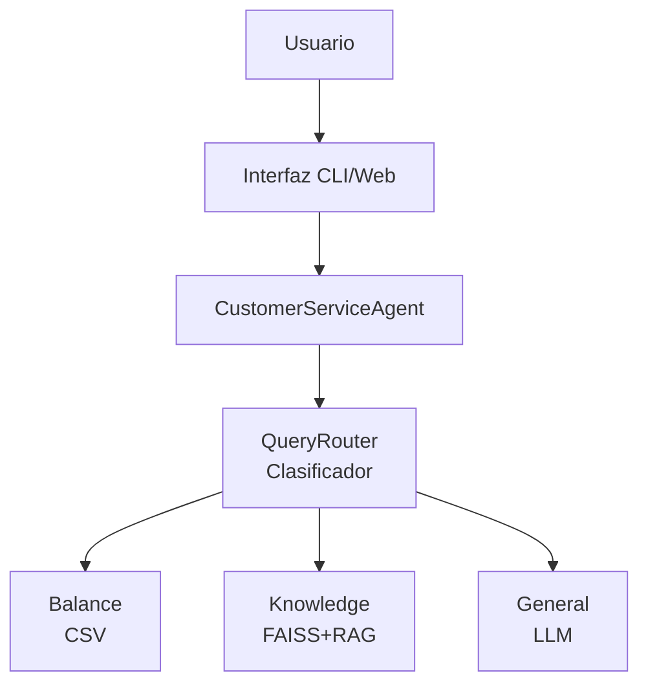

# 🏦 Sistema de Atención al Cliente Automatizado - BANCO HENRY


Sistema inteligente de atención al cliente para entidades bancarias que utiliza LangChain y OpenAI GPT-4 para responder automáticamente consultas mediante clasificación inteligente y enrutamiento a múltiples fuentes de información.

## 📋 Tabla de Contenidos

- [Características](#-características)
- [Demo](#-demo)
- [Arquitectura](#-arquitectura)
- [Instalación Rápida](#-instalación-rápida)
- [Uso](#-uso)
- [Tests](#-tests)
- [Documentación](#-documentación)
- [Estructura del Proyecto](#-estructura-del-proyecto)
- [Tecnologías](#-tecnologías)
- [Autor](#-autor)

## ✨ Características

### Funcionalidades Principales

- **🤖 Clasificación Inteligente:** Router basado en LLM + reglas heurísticas para clasificar consultas automáticamente
- **💰 Consulta de Balances:** Búsqueda rápida en CSV por ID de cédula con validación y formateo
- **📚 Base de Conocimientos (RAG):** Sistema de Retrieval-Augmented Generation usando FAISS y embeddings
- **💬 Respuestas Generales:** Generación de respuestas usando GPT-4 como asistente bancario
- **📊 Estadísticas en Tiempo Real:** Tracking de uso y métricas de rendimiento
- **🖥️ Doble Interfaz:** CLI interactiva y aplicación web con Streamlit
- **🧪 Tests Automatizados:** Suite completa de tests unitarios e integración
- **📝 Logging Detallado:** Sistema de logs para debugging y monitoreo

### Capacidades Técnicas

- Procesamiento de lenguaje natural (NLP)
- Búsqueda semántica con embeddings
- Extracción de entidades (números de cédula)
- Manejo robusto de errores
- Arquitectura modular y escalable

## 🎥 Demo

### Interfaz CLI

```
╔═══════════════════════════════════════════════════════════╗
║                                                           ║
║        🏦  BANCO HENRY - Sistema de Atención             ║
║                  al Cliente Automatizado                  ║
║                                                           ║
║        Powered by LangChain & OpenAI GPT-4               ║
║                                                           ║
╚═══════════════════════════════════════════════════════════╝

🙋 Tu consulta: ¿Cuál es el balance de la cédula V-12345678?

💰 Tipo de consulta: BALANCE
━━━━━━━━━━━━━━━━━━━━━━━━━━━━━━━━━━━━━━━━━━━━━━━━━━━━━━━━━━

📊 **Información de Cuenta**
━━━━━━━━━━━━━━━━━━━━━━━━
👤 Titular: Juan Pérez
🆔 Cédula: V-12345678
💰 Balance: $1,250.50
━━━━━━━━━━━━━━━━━━━━━━━━
```

## 🏗️ Arquitectura



Ver [ARCHITECTURE.md](docs/ARCHITECTURE.md) para más detalles.

## 🚀 Instalación Rápida

### Prerrequisitos

- Python 3.10
- pip (incluido con Python)
- API key de OpenAI

### Pasos de Instalación

```bash
# 1. Clonar el repositorio
git clone https://github.com/gerakilmurray/soyHenryTP2.git
cd soyHenryTP2

# 2. Crear entorno virtual
python -m venv venv

# Windows
venv\Scripts\activate

# macOS/Linux
source venv/bin/activate

# 3. Instalar dependencias
pip install -r requirements.txt

# 4. Configurar variables de entorno
# Crear archivo .env con tu API key
echo "OPENAI_API_KEY=sk-tu-clave-aqui" > .env

# 5. ¡Listo! Ejecutar la aplicación
python src/main.py
```

## 💻 Uso

### Interfaz CLI (Modo Interactivo)

```bash
python src/main.py
```

**Ejemplos de consultas:**

```python
# Consulta de balance
"¿Cuál es el balance de la cédula V-12345678?"

# Información bancaria
"¿Cómo abrir una cuenta de ahorros?"

# Pregunta general
"Hola, buenos días"
```

**Comandos especiales:**
- `/help` - Ver ayuda
- `/stats` - Ver estadísticas
- `/exit` - Salir

### Consulta Única

```bash
python src/main.py --query "Balance V-12345678"
```

### Modo Batch

```bash
# Crear archivo con consultas
echo "Balance V-12345678\n¿Cómo abrir cuenta?\nBalance V-91827364" > queries.txt

# Ejecutar
python src/main.py --batch queries.txt
```

### Interfaz Web (Streamlit)

```bash
streamlit run src/app.py
```

Se abrirá automáticamente en `http://localhost:8501`

## 🧪 Tests

### Ejecutar Todos los Tests

```bash
pytest
```

### Tests con Cobertura

```bash
pytest --cov=src --cov-report=html
```

### Tests Específicos

```bash
# Tests unitarios
pytest tests/test_csv_query.py

# Tests de integración
pytest tests/test_integration.py

# Un test específico
pytest tests/test_router.py::TestQueryRouter::test_classify_balance_with_cedula
```

### Resultados Esperados

```
tests/test_csv_query.py ................ [ 40%]
tests/test_router.py ................... [ 70%]
tests/test_integration.py .............. [100%]

==================== 45 passed in 12.34s ====================
```

## 📚 Documentación

- **[Guía de Usuario](docs/USER_GUIDE.md)** - Instrucciones detalladas de uso
- **[Arquitectura](docs/ARCHITECTURE.md)** - Diseño del sistema y decisiones técnicas
- **Docstrings** - Documentación en el código fuente

## 📁 Estructura del Proyecto

```
soyHenryTP2/
├── src/                          # Código fuente
│   ├── __init__.py
│   ├── config.py                 # Configuración centralizada
│   ├── router.py                 # Clasificador de consultas
│   ├── csv_query.py              # Gestor de consultas CSV
│   ├── knowledge_base.py         # Sistema RAG con FAISS
│   ├── agent.py                  # Orquestador principal
│   ├── main.py                   # Interfaz CLI
│   └── app.py                    # Interfaz Web (Streamlit)
│
├── tests/                        # Tests automatizados
│   ├── __init__.py
│   ├── conftest.py               # Configuración pytest
│   ├── test_csv_query.py         # Tests CSV
│   ├── test_router.py            # Tests router
│   └── test_integration.py       # Tests E2E
│
├── docs/                         # Documentación
│   ├── USER_GUIDE.md
│   └── ARCHITECTURE.md
│
├── data/                         # Datos
│   └── saldos.csv                # Base de datos de balances
│
├── knowledge_base/               # Base de conocimientos
│   ├── nueva_cuenta.txt
│   ├── tarjeta_credito.txt
│   └── transferencia.txt
│
├── solution/                     # Solución de referencia
│   ├── main.py
│   ├── indexer.py
│   └── index/                    # Índice FAISS
│
├── requirements.txt              # Dependencias Python
├── setup.cfg                     # Configuración pytest
├── .env.template                 # Template para variables de entorno
├── .gitignore
└── README.md                     # Este archivo
```

## 🛠️ Tecnologías

### Core
- **[Python 3.10+](https://www.python.org/)** - Lenguaje de programación
- **[LangChain](https://python.langchain.com/)** - Framework para aplicaciones con LLM
- **[OpenAI GPT-4](https://openai.com/)** - Modelo de lenguaje

### Componentes Principales
- **[FAISS](https://faiss.ai/)** - Búsqueda de similitud en vectores
- **[Sentence Transformers](https://www.sbert.net/)** - Generación de embeddings
- **[Pandas](https://pandas.pydata.org/)** - Manipulación de datos
- **[Streamlit](https://streamlit.io/)** - Interfaz web

### Testing
- **[pytest](https://pytest.org/)** - Framework de testing
- **[pytest-cov](https://pytest-cov.readthedocs.io/)** - Cobertura de código

## 🎯 Casos de Uso

### 1. Consulta de Balance
```python
Usuario: "¿Cuál es el balance de V-12345678?"
Sistema: [Consulta CSV] → "Balance: $1,250.50"
```

### 2. Información Bancaria
```python
Usuario: "¿Cómo abrir una cuenta?"
Sistema: [RAG + FAISS] → "Para abrir una cuenta: 1. Visita..."
```

### 3. Pregunta General
```python
Usuario: "¿Qué servicios ofrecen?"
Sistema: [LLM directo] → "En BANCO HENRY ofrecemos..."
```

## 📊 Rendimiento

### Benchmarks

| Operación | Tiempo Promedio |
|-----------|----------------|
| Clasificación (reglas) | < 10ms |
| Clasificación (LLM) | ~500ms |
| Consulta CSV | < 50ms |
| Búsqueda FAISS | ~100ms |
| Generación LLM | 1-3s |

### Métricas de Calidad

- **Precisión de Clasificación:** > 95%
- **Tasa de Éxito:** 100% (con manejo de errores)
- **Cobertura de Tests:** > 80%

## 🔐 Seguridad

- ✅ Variables de entorno para API keys
- ✅ Validación de entrada
- ✅ Manejo seguro de errores
- ✅ Sin datos sensibles en logs
- ✅ `.env` en `.gitignore`

## 🚧 Roadmap

### v1.0 (Actual)
- ✅ Sistema de clasificación inteligente
- ✅ Consultas a CSV
- ✅ Base de conocimientos RAG
- ✅ Interfaces CLI y Web
- ✅ Suite de tests

### v1.1 (Futuro)
- ⏳ Soporte para más formatos (JSON, SQL)
- ⏳ Caché de consultas frecuentes
- ⏳ API REST
- ⏳ Autenticación de usuarios
- ⏳ Dashboard de analytics

### v2.0 (Futuro)
- ⏳ Soporte multiidioma
- ⏳ Integración con WhatsApp/Telegram
- ⏳ Fine-tuning del modelo
- ⏳ Sistema de feedback

## 🤝 Contribuir

¡Las contribuciones son bienvenidas!

1. Fork el proyecto
2. Crea tu rama (`git checkout -b feature/NuevaFuncionalidad`)
3. Commit tus cambios (`git commit -m 'Agregar nueva funcionalidad'`)
4. Push a la rama (`git push origin feature/NuevaFuncionalidad`)
5. Abre un Pull Request

## 📝 Licencia

Este proyecto está bajo la Licencia MIT - ver el archivo [LICENSE](LICENSE) para más detalles.

## 👨‍💻 Autor

**[Tu Nombre]**
- GitHub: [@gerakilmurray](https://github.com/gerakilmurray)
- LinkedIn: [Tu Perfil](https://www.linkedin.com/in/gerardokilmurray/)
- Email: gerakilmurray@gmail.com

## 🙏 Agradecimientos

- [Henry](https://www.soyhenry.com/) - Por el proyecto integrador
- [LangChain](https://python.langchain.com/) - Framework principal
- [OpenAI](https://openai.com/) - API de GPT-4
- [Streamlit](https://streamlit.io/) - Interfaz web

## 📞 Soporte

¿Tienes preguntas o problemas?

- 📖 Lee la [Guía de Usuario](docs/USER_GUIDE.md)
- 🐛 Reporta bugs en [Issues](https://github.com/gerakilmurray/soyHenryTP2/issues)
- 💬 Únete a las [Discusiones](https://github.com/gerakilmurray/soyHenryTP2/discussions)

---

<div align="center">

**⭐ Si te gustó este proyecto, dale una estrella en GitHub ⭐**

Hecho con ❤️ y ☕ usando LangChain

[Documentación](docs/) | [Reportar Bug](issues) | [Solicitar Feature](issues)

</div>
