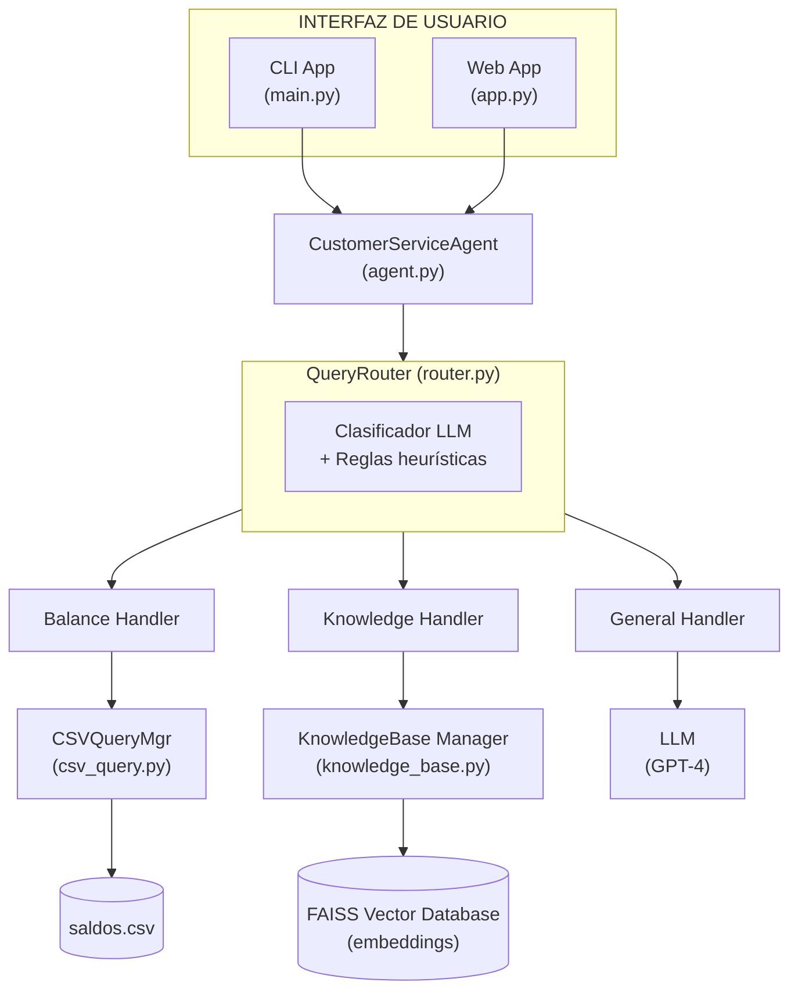
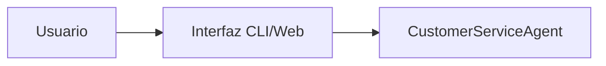
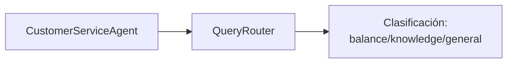
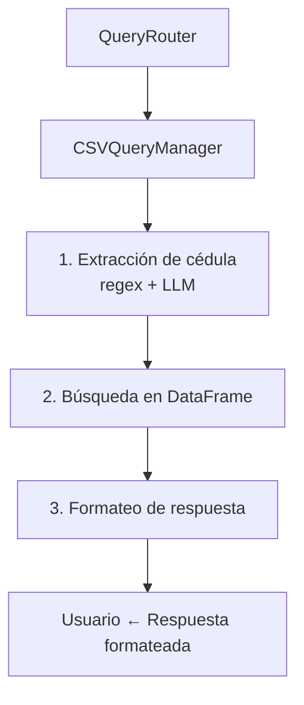
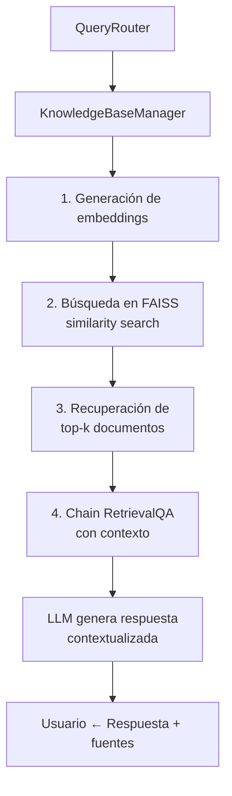
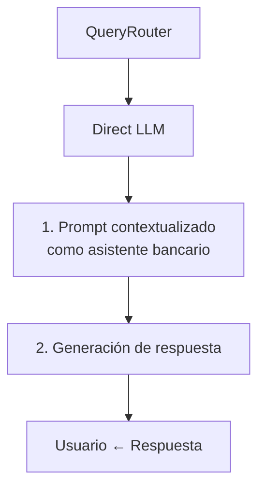
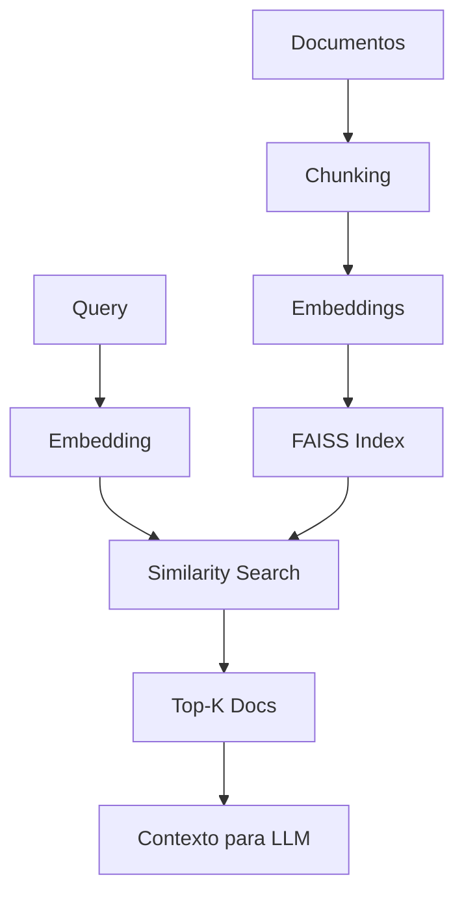
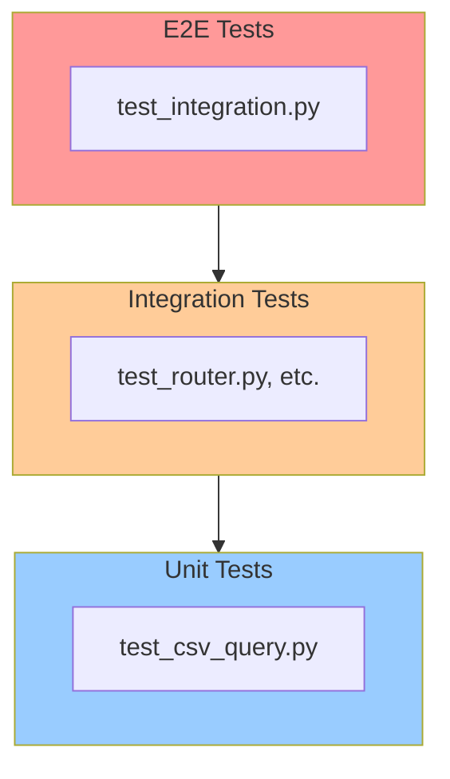
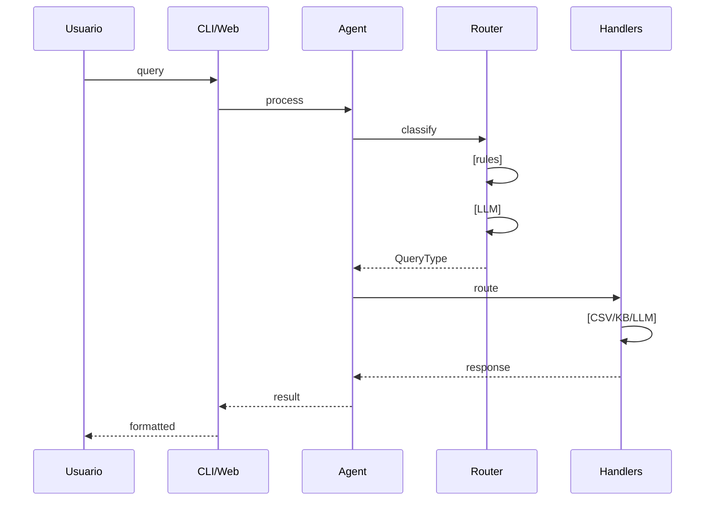

# 🏗️ Arquitectura del Sistema

## Descripción General

El Sistema de Atención al Cliente Automatizado es una aplicación basada en LangChain que utiliza Inteligencia Artificial para responder automáticamente a consultas bancarias. El sistema clasifica inteligentemente las consultas y las enruta a la fuente de información más apropiada.

## 📐 Arquitectura de Componentes



## 🔄 Flujo de Procesamiento

### 1. Recepción de Consulta


### 2. Clasificación


**Proceso de Clasificación:**
- **Paso 1:** Clasificación basada en reglas (rápida)
  - Patrones regex para cédulas
  - Palabras clave específicas
- **Paso 2:** Clasificación con LLM (si no match en reglas)
  - Prompt especializado
  - Clasificación determinista (temperature=0)

### 3. Enrutamiento y Procesamiento

#### A. Consulta de Balance (balance)


#### B. Consulta de Conocimientos (knowledge)


#### C. Consulta General (general)


## 🧩 Componentes Principales

### 1. config.py
**Propósito:** Configuración centralizada del sistema

**Responsabilidades:**
- Cargar variables de entorno
- Definir rutas del proyecto
- Configurar parámetros del modelo
- Configurar embeddings y retriever

### 2. router.py
**Propósito:** Clasificación inteligente de consultas

**Componentes:**
- `QueryType` (Enum): Tipos de consulta
- `QueryRouter` (Clase principal)

**Métodos clave:**
- `classify_query()`: Clasifica la consulta
- `_rule_based_classification()`: Reglas heurísticas
- `extract_cedula()`: Extrae número de cédula

**Estrategia de Clasificación:**
1. Intentar clasificación por reglas (O(1))
2. Si falla, usar LLM (O(n))
3. Extracción de entidades (cédulas)

### 3. csv_query.py
**Propósito:** Gestión de consultas a datos estructurados

**Componentes:**
- `CSVQueryManager`: Gestor principal

**Métodos clave:**
- `get_balance_by_cedula()`: Consulta principal
- `search_by_name()`: Búsqueda por nombre
- `get_all_accounts()`: Listar todas las cuentas

**Optimizaciones:**
- Carga única del CSV en memoria
- Búsqueda en DataFrame (rápida)
- Normalización de entrada (uppercase, strip)

### 4. knowledge_base.py
**Propósito:** Sistema RAG (Retrieval-Augmented Generation)

**Componentes:**
- `KnowledgeBaseManager`: Gestor de vectores

**Métodos clave:**
- `search()`: Búsqueda semántica
- `create_index()`: Crear/actualizar índice
- `get_retriever()`: Retriever para chains

**Pipeline RAG:**


**Modelo de Embeddings:**
- `sentence-transformers/all-MiniLM-L6-v2`
- 384 dimensiones
- Balance entre velocidad y calidad

### 5. agent.py
**Propósito:** Orquestador principal del sistema

**Componentes:**
- `CustomerServiceAgent`: Agente principal

**Métodos clave:**
- `process_query()`: Procesamiento principal
- `_handle_balance_query()`: Handler de balance
- `_handle_knowledge_query()`: Handler de knowledge
- `_handle_general_query()`: Handler general
- `get_statistics()`: Estadísticas de uso

**Características:**
- Manejo de errores robusto
- Tracking de estadísticas
- Logging detallado
- Respuestas estructuradas

### 6. main.py
**Propósito:** Interfaz CLI interactiva

**Modos de operación:**
- **Interactivo:** Sesión de chat
- **Consulta única:** `--query "..."`
- **Batch:** `--batch archivo.txt`

**Comandos especiales:**
- `/help`: Ayuda
- `/stats`: Estadísticas
- `/clear`: Limpiar pantalla
- `/exit`: Salir

### 7. app.py
**Propósito:** Interfaz web con Streamlit

**Características:**
- UI moderna y responsive
- Historial de conversación
- Visualización de estadísticas
- Documentos fuente (knowledge)
- Caché del agente (`@st.cache_resource`)

## 🔐 Seguridad y Buenas Prácticas

### Variables de Entorno
```python
# .env (no versionado)
OPENAI_API_KEY=sk-...
```

### Validación de Entrada
```python
# Sanitización de cédulas
cedula = cedula.strip().upper()

# Validación de formato
if not cedula:
    raise ValueError("ID de cédula no puede estar vacío")
```

### Manejo de Errores
```python
try:
    result = process_query(query)
except Exception as e:
    logger.error(f"Error: {e}", exc_info=True)
    return error_response(e)
```

## 📊 Métricas y Monitoreo

### Estadísticas Rastreadas
- Total de consultas
- Consultas por tipo (balance/knowledge/general)
- Tasa de éxito
- Tiempo de respuesta (futuro)

### Logging
```python
# Niveles de logging
logger.info("Operación exitosa")
logger.warning("Situación anómala")
logger.error("Error recuperable")
logger.critical("Error fatal")
```

## 🚀 Escalabilidad

### Optimizaciones Actuales
- Carga única del CSV en memoria
- Caché de embeddings model
- FAISS para búsquedas O(log n)
- Clasificación por reglas (rápida)

### Mejoras Futuras
1. **Caché de consultas frecuentes**
   ```python
   @lru_cache(maxsize=1000)
   def get_balance_cached(cedula: str) -> Dict
   ```

2. **Base de datos real**
   - Migrar de CSV a PostgreSQL/MongoDB
   - Índices optimizados

3. **Caché de embeddings**
   - Redis para vectores frecuentes
   - Reducir llamadas al modelo

4. **Procesamiento asíncrono**
   ```python
   async def process_query_async(query: str)
   ```

5. **Balanceo de carga**
   - Múltiples instancias del agente
   - Queue system (Celery/RabbitMQ)

## 🧪 Testing

### Jerarquía de Testing


### Cobertura de Tests
- **Unit Tests:** Funciones individuales
- **Integration Tests:** Interacción entre módulos
- **E2E Tests:** Flujos completos

## 📈 Rendimiento

### Benchmarks Esperados
- Clasificación por reglas: < 10ms
- Clasificación con LLM: 500-1000ms
- Consulta CSV: < 50ms
- Búsqueda FAISS: 50-100ms
- Generación con LLM: 1-3s

### Optimizaciones
```python
# Batch processing
async def process_batch(queries: List[str]):
    tasks = [process_query_async(q) for q in queries]
    return await asyncio.gather(*tasks)
```

## 🔄 Diagrama de Secuencia



## 🎯 Decisiones de Diseño

### 1. ¿Por qué separar router.py?
- **Razón:** Separación de responsabilidades
- **Beneficio:** Router puede cambiar sin afectar handlers
- **Alternativa:** Integrar en agent.py (más acoplado)

### 2. ¿Por qué FAISS local?
- **Razón:** Sin dependencias externas, más rápido
- **Beneficio:** Deploy simple, latencia baja
- **Alternativa:** Pinecone/Weaviate (más escalable)

### 3. ¿Por qué GPT-4?
- **Razón:** Mejor comprensión y generación
- **Beneficio:** Respuestas más precisas
- **Alternativa:** GPT-3.5 (más barato, menos preciso)

### 4. ¿Por qué Streamlit?
- **Razón:** Rápido de desarrollar, bonito
- **Beneficio:** UI profesional con poco código
- **Alternativa:** React (más flexible, más complejo)

## 📚 Referencias

- [LangChain Documentation](https://python.langchain.com/)
- [FAISS Documentation](https://faiss.ai/)
- [Sentence Transformers](https://www.sbert.net/)
- [Streamlit Documentation](https://docs.streamlit.io/)
